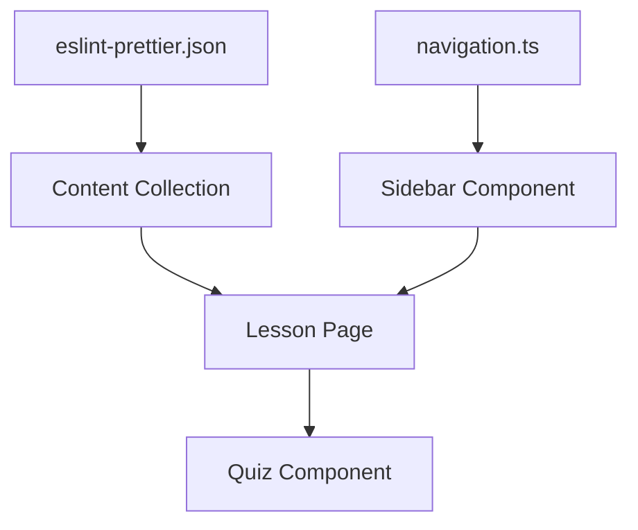

# Design Document: ESLint & Prettier レッスン

## Overview

Web開発学習サイトに「ESLint & Prettier」レッスンを追加する。このレッスンでは、最もポピュラーなリンター（ESLint）とフォーマッター（Prettier）の基本概念、インストール方法、設定方法、併用方法を学習者に提供する。

既存のレッスン構造（JSONファイル + ナビゲーション設定）に準拠し、「ツール」セクションに配置する。

## Architecture



レッスンは既存のAstro Content Collectionsアーキテクチャを使用する：
1. JSONファイルでレッスンデータを定義
2. Zodスキーマで検証
3. 動的ルーティングでページ生成
4. サイドバーナビゲーションからアクセス

## Components and Interfaces

### 1. レッスンJSONファイル

**ファイルパス:** `src/content/lessons/eslint-prettier.json`

```typescript
interface LessonData {
  id: string;           // "eslint-prettier"
  category: string;     // "nodejs"
  title: string;        // "ESLint & Prettier"
  description: string;  // レッスンの説明
  content: string;      // HTML形式のコンテンツ
  exercises: Exercise[];
}

interface Exercise {
  question: string;
  options: string[];    // 4つの選択肢
  answer: number;       // 正解のインデックス（0始まり）
  explanation: string;
}
```

### 2. ナビゲーション設定

**ファイルパス:** `src/data/navigation.ts`

```typescript
// 「ツール」セクションに追加
{
  id: 'eslint-prettier',
  icon: '🔍',
  label: 'ESLint & Prettier',
  badge: 'nodejs'
}
```

## Data Models

### レッスンコンテンツ構造

レッスンのHTMLコンテンツは以下のセクションで構成：

1. **リンターとフォーマッターとは**
   - 概念の説明
   - 役割の違い

2. **ESLintの基本**
   - インストール方法
   - 設定ファイル（eslint.config.js）
   - 検出できるエラーの例

3. **Prettierの基本**
   - インストール方法
   - 設定ファイル（.prettierrc）
   - フォーマット前後の比較

4. **ESLintとPrettierの併用**
   - eslint-config-prettierの設定
   - 推奨ワークフロー

### 演習問題データ

3問の演習問題：
1. ESLintの役割に関する問題
2. Prettierの役割に関する問題
3. ESLintとPrettierの違いに関する問題


## Correctness Properties

*A property is a characteristic or behavior that should hold true across all valid executions of a system-essentially, a formal statement about what the system should do. Properties serve as the bridge between human-readable specifications and machine-verifiable correctness guarantees.*

### Property 1: レッスンJSONの構造検証

*For any* レッスンJSONファイル, id、category、title、description、content、exercisesフィールドがすべて存在し、適切な型を持つこと

**Validates: Requirements 3.2**

### Property 2: 演習問題の構造検証

*For any* 演習問題オブジェクト, question（文字列）、options（4要素の配列）、answer（0-3の整数）、explanation（文字列）フィールドがすべて存在すること

**Validates: Requirements 4.1, 1.7**

## Error Handling

### コンテンツ読み込みエラー

- JSONファイルが存在しない場合：Astroビルド時にエラー
- スキーマ検証失敗：Zodによるエラーメッセージ表示
- ナビゲーションアイテム未登録：404ページ表示

### 演習問題エラー

- 正解インデックスが範囲外：スキーマ検証で防止（min(0)）
- 選択肢が空：スキーマ検証で防止

## Testing Strategy

### Unit Tests

既存のテストフレームワーク（Vitest）を使用：

1. **レッスンデータ検証テスト**
   - eslint-prettier.jsonの存在確認
   - 必須フィールドの存在確認
   - categoryが「nodejs」であることの確認

2. **ナビゲーション統合テスト**
   - 「ツール」セクションにeslint-prettierが存在することの確認
   - TOTAL_LESSONSが26であることの確認

3. **演習問題テスト**
   - 演習問題が3問以上あることの確認
   - 各問題の構造が正しいことの確認

### Property-Based Tests

Vitestのプロパティベーステスト機能を使用：

1. **Property 1のテスト**
   - レッスンJSONの構造が正しいことを検証
   - **Tag: Feature: linter-formatter-lesson, Property 1: レッスンJSONの構造検証**

2. **Property 2のテスト**
   - 演習問題の構造が正しいことを検証
   - **Tag: Feature: linter-formatter-lesson, Property 2: 演習問題の構造検証**

### テスト設定

- 最低100回のイテレーション（プロパティテスト）
- テストファイル: `src/__tests__/eslint-prettier-lesson.test.ts`
